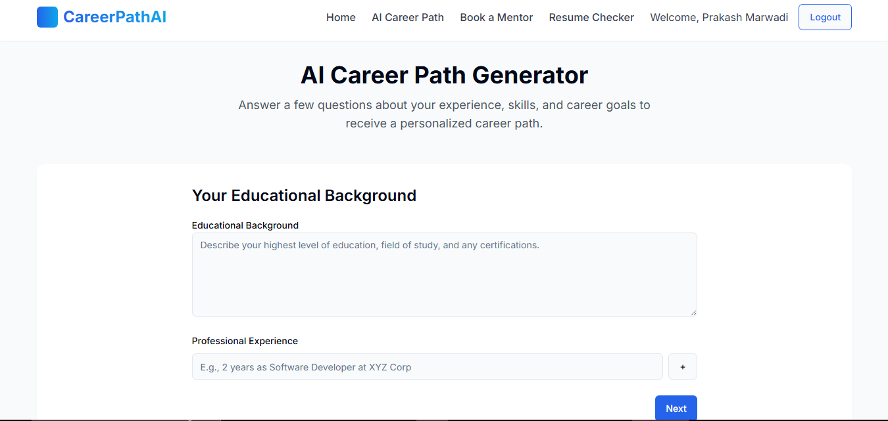
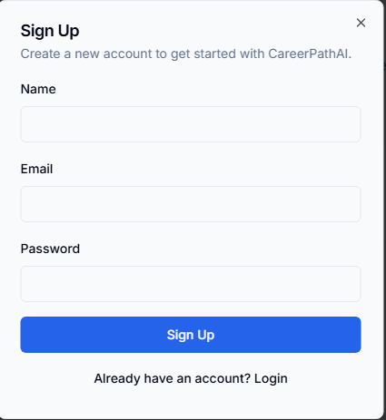
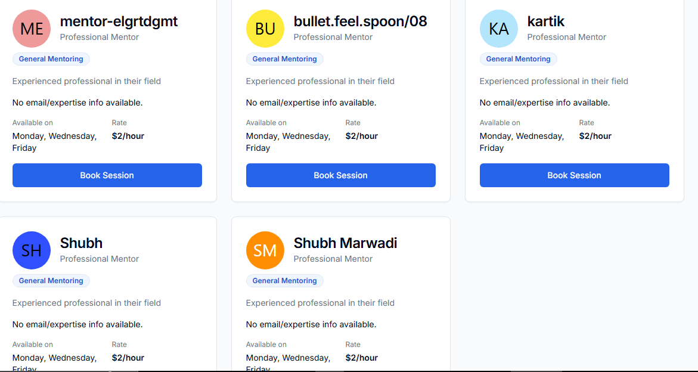
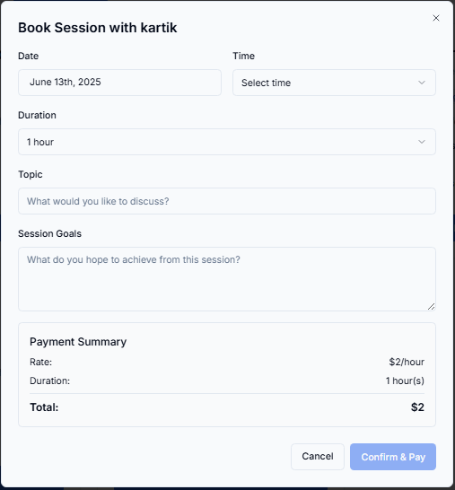
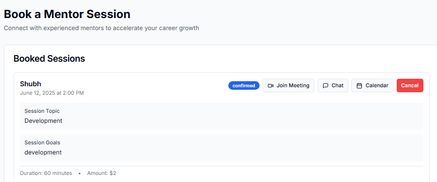
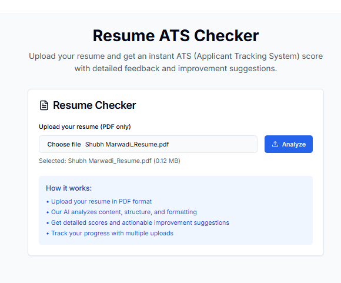
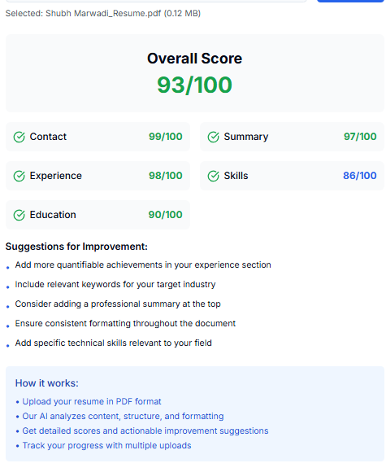

# MentoerAI – AI-Powered Career Guidance Platform

MentoerAI is a modern, AI-powered career guidance and mentorship booking platform integrated with Payman. Users can generate personalized career paths using the Gemini API, analyze their resumes with an ATS tracker, and book paid mentorship sessions seamlessly.

Live App: [🔗 Vercel Link](https://payman-project.vercel.app/)

---

## 🎯 Key Features

### 🧭 Career Path Generator

* Generate personalized career paths using the **Gemini API**
* AI-driven recommendations based on interests and skills
* Display structured learning roadmap and skill development plan

### 🧑‍💼 Resume ATS Checker

* Upload resumes in PDF format
* Analyze ATS (Applicant Tracking System) compatibility
* Get section-wise feedback (Summary, Skills, Experience, etc.)
* Improve suggestions and scoring system

### 👨‍🏫 Mentor Booking System

* **Real Mentors via Payman**: Fetch mentors from your Payman payees
* **Book Sessions**: Schedule one-on-one mentoring sessions
* **Add to Calendar**: Automatically add booked sessions to your calendar
* **Chat with Mentor**: Initiate and maintain chat with mentor before and after session
* **Payment Processing**: Use Payman SDK for secure transactions
* **Cancel Meeting**: Cancel sessions directly on the platform
* **Booked Sessions Tracker**: View your upcoming and past bookings
* **Add Mentor**: Admins or mentors can add themselves, visible in real-time

### 💼 Admin & Mentor Tools

* Role-based mentor/admin addition
* Track all bookings and cancellations
* Admin Panel with wallet, history, and mentor control

---
## 📱 Application Screenshots

### 1. Home Page

*Landing page with feature overview and navigation*

### 2. Career Generator

*AI-powered career path recommendations based on your profile*

### 3. Mentor Booking - Login

*Payman credentials input for secure connection*

### 4. Mentor Booking - Mentor List

*List of available mentors fetched from Payman payees*

### 5. Booking Form

*Session booking form with payment integration*
### 6.  Booked Sessions

View of all successfully booked sessions with mentor details, date, calander and chat.
### 7. Resume ATS Checker

*Resume upload and ATS score analysis interface*

### 8. Resume Results

*Detailed ATS score breakdown with improvement suggestions*

## 🧩 Application Flows

### 🧠 Career Path Flow

```
User Login
    ↓
Career Path Page
    ↓
Enter Interests + Profile Data
    ↓
↳ Gemini API Generates Career Map
    ↓
View Suggestions & Skill Plan
```

### 📄 Resume Checker Flow

```
User Uploads Resume
    ↓
ATS Analysis Initiated
    ↓
Parsed & Evaluated Resume
    ↓
Score Breakdown & Suggestions
```

### 🧑‍🏫 Mentor Booking Flow

```
User Authenticates
    ↓
Fetch Payman Mentors
    ↓
Select Mentor + Slot
    ↓
Make Payment via Payman
    ↓
Booking Confirmed
    ↓
Add to Calendar
    ↓
Start Chat with Mentor
    ↓
View in Booked Sessions
```

### 🔁 Session Management Flow

```
User Books Session
    ↓
Appears in BookedSessions.tsx
    ↓
User Can:
   ↳ Cancel Session
   ↳ View Details
   ↳ Connect for Session
   ↳ Access Chat
```

### 🏢 Admin Flow

```
Admin Login
    ↓
Mentor Management Page
    ↓
Add/View Mentors
    ↓
Book Session with Mentor
    ↓
Cancel/Join Google Meet with Mentor
    ↓
Add to Calendar / Initiate Chat
    ↓
Track Session Activity
    ↓
View Transaction History via Payman
```

---

## 📦 Installation Guide

```bash
git clone <your-repo-url>
cd mentoer-ai
npm install
npm run dev
```

Open in browser: `http://localhost:5173`

---

## 🔧 Payman Setup

### Prerequisites

* A Payman account with Client ID and Secret

### Steps

1. Go to Mentor Booking page
2. Enter Payman Credentials:

   * Client ID (starts with `pm-`)
   * Client Secret
3. Click “Connect to Payman”

### Features After Connection

* Fetch Payees (Mentors)
* Book & Pay for Sessions
* View Transaction History
* Check Wallet Balance

---

---

## 🔐 Security Features

* LocalStorage authentication
* No credentials stored in DB
* Secure Payman token management
* Role-based session protection
* Error handling and user alerts

---

## 🚀 Deployment

```bash
npm run build
npm run preview
```

Platform Hosted on: [Vercel](https://vercel.com)

---

## 🤝 Contributing

1. Fork the repo
2. Create your feature branch (`git checkout -b feature/awesome`)
3. Commit your changes (`git commit -m 'Add awesome feature'`)
4. Push to the branch (`git push origin feature/awesome`)
5. Create a Pull Request

---

## 📬 Support

* Gemini API: [Google Developers](https://developers.google.com/)
* Payman SDK Docs: [Payman Docs](https://docs.payman.ai)
* Raise issues in the repo for bugs/requests

---

## ✅ Milestones

* ✅ AI-powered roadmap generator (Gemini)
* ✅ Resume parser & ATS checker
* ✅ Payman-integrated mentorship system
* ✅ Real-time session cancel and booking updates
* ✅ Session tracker & mentor onboarding
* ✅ Admin flow and role-based mentor control

---

Built with ❤️ by Shubh Marwadi
